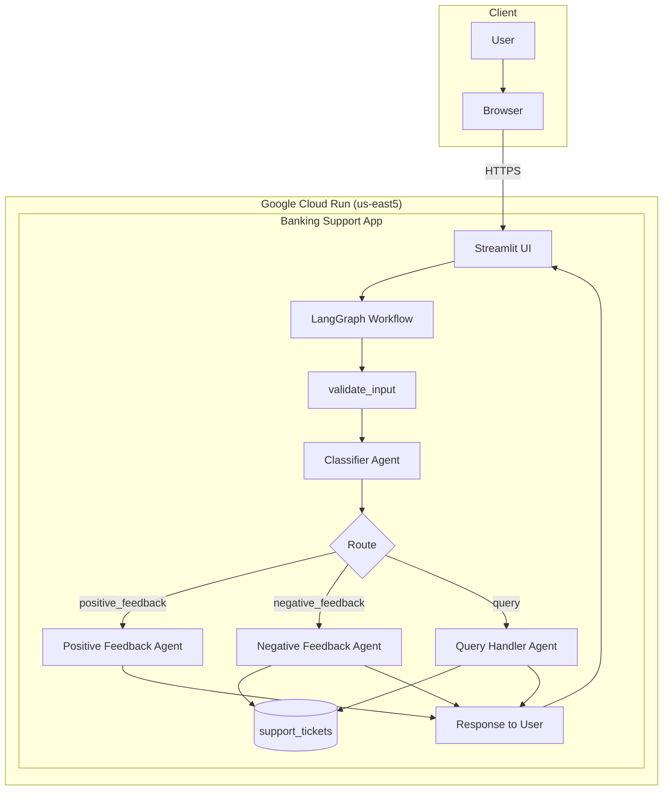

# Banking Support — Architecture Diagram

Open this file in [Mermaid Live Editor](https://mermaid.live) or in VS Code with a Mermaid extension, then take a screenshot to upload to your portfolio.

## Component summary

| Component | Role |
|-----------|------|
| **Streamlit UI** | Dashboard: user input, classification display, ticket logs, prompt traces |
| **LangGraph Workflow** | Orchestrates validate_input → classifier → routing to specialized agents |
| **Classifier Agent** | Categorizes message: positive feedback / negative feedback / query |
| **Positive Feedback Agent** | Generates thank-you message via LLM |
| **Negative Feedback Agent** | Creates ticket in DB, returns empathetic message with ticket ID |
| **Query Handler Agent** | Looks up ticket status in DB, returns status to user |
| **support_tickets** | Database table for ticket ID, status, and related fields |
