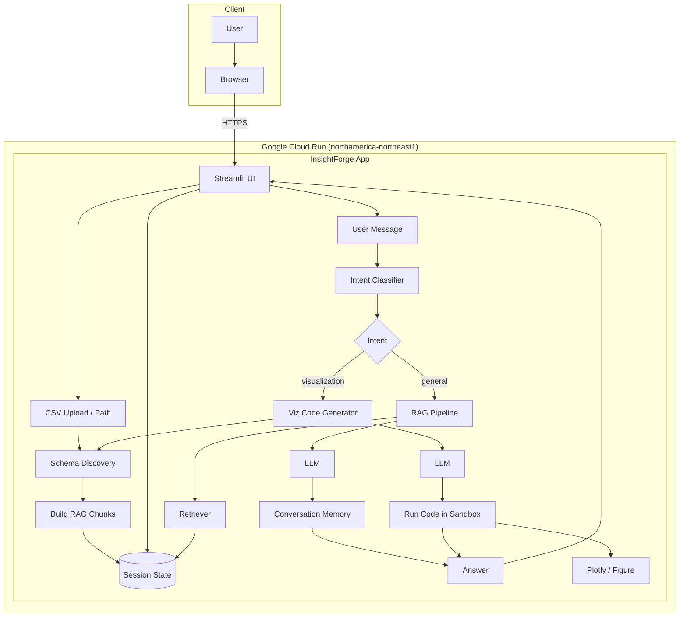

# InsightForge — Architecture Diagram

Open this file in [Mermaid Live Editor](https://mermaid.live) or in VS Code with a Mermaid extension, then take a screenshot to upload to your portfolio.

## Component summary

| Component | Role |
|-----------|------|
| **Streamlit UI** | Chat interface; CSV upload; schema/chunks in session state; pipeline log viewer |
| **Schema Discovery** | Infers column names and types from the session CSV |
| **RAG Chunks** | Session data chunked for retrieval (knowledge base) |
| **Intent Classifier** | Classifies user message as general question vs visualization request |
| **RAG Pipeline** | Retriever → context + prompt → LLM → answer; uses conversation memory |
| **Viz Code Generator** | LLM generates Python code (e.g. Plotly) using CSV path and schema |
| **Sandbox** | Executes generated code safely; returns figure or error |
| **Conversation Memory** | Maintains chat context for follow-up questions |
